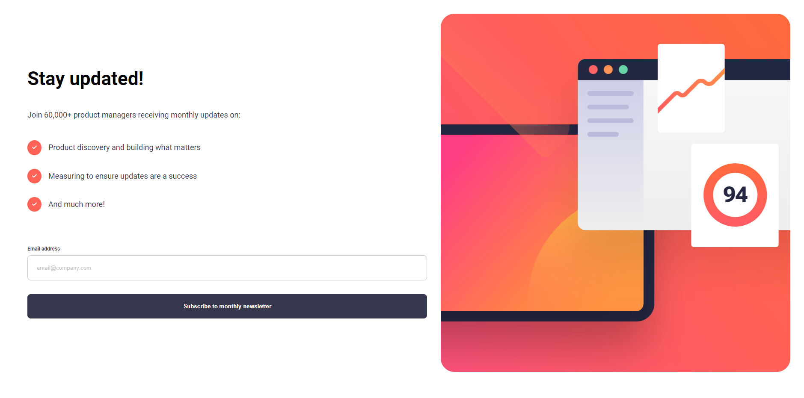

# Frontend Mentor - Newsletter sign-up form with success message solution

This is a solution to the [Newsletter sign-up form with success message challenge on Frontend Mentor](https://www.frontendmentor.io/challenges/newsletter-signup-form-with-success-message-3FC1AZbNrv). Frontend Mentor challenges help you improve your coding skills by building realistic projects. 

## Table of contents

- [Overview](#overview)
  - [The challenge](#the-challenge)
  - [Screenshot](#screenshot)
  - [Links](#links)
- [My process](#my-process)
  - [Built with](#built-with)
  - [What I learned](#what-i-learned)
  - [Continued development](#continued-development)
- [Author](#author)
- [Acknowledgments](#acknowledgments)


## Overview

### The challenge

Users should be able to:

- Add their email and submit the form
- See a success message with their email after successfully submitting the form
- See form validation messages if:
  - The field is left empty
  - The email address is not formatted correctly
- View the optimal layout for the interface depending on their device's screen size
- See hover and focus states for all interactive elements on the page

### Screenshot




### Links

- Solution URL: [solution URL](https://www.frontendmentor.io/solutions/news-letter-sign-up-m36qdWEDez)
- Live Site URL: [live site](https://00awaudby.github.io/newsletter-sign-up/)

## My process

### Built with

- Semantic HTML5 markup
- CSS custom properties
- Flexbox
- Mobile-first workflow
- Javascript
- [Styled Components](https://styled-components.com/) - For styles


### What I learned

I feel i learned a lot in terms of functions , the different types of scope and how we use them and how it would effect the project if we didnt understand scope and when and where to impliment the use of it.

See some snippets of the code i pulled some of my favirout bits from this project.

```html
      <form id="form">
        <div class="form-control">
          <label id="label" for="email">Email address</label>
          <p id="error-text1" class="remove-text">Email Adress Is Invalid!</p>
        </div>
        <input type="email" name="email" id="input" placeholder="email@company.com">
        <button>Subscribe to monthly newsletter</button>
      </form>
```
```css
@media(min-width: 967px){
    .container{
     display: flex;
     flex-direction: row-reverse;
     padding: 2rem;
     font-size: 22px;
 }
 
    .hero{
     width: 45%;
     height:90vh;
     border-top-left-radius: 2rem;
     border-top-right-radius: 2rem;
     
    }
 
    .main-info{
     width: 55%;
     gap: 3rem;
    }
 
   button, input{
     width: 100%;
   }
 
    .main-inf-header{
     font-size:70px;
    }
 }
 

```
```js
function checkEmail() {
    if (!filter.test(input.value)) {
        input.classList.add("error");
        errorText.classList.remove("remove-text");
        errorText.classList.add("error-text");
        input.focus;
        return false;
    }else{
        input.classList.remove("error");
        errorText.classList.add("remove-text");
        errorText.classList.remove("error-text");
    }
}
```

### Continued development

I want to build lots more projects with js while taking a react js course.to further my knmowledge in javascript as a whole.

## Author


- Frontend Mentor - [@00awaudby](https://www.frontendmentor.io/profile/00awaudby)


## Acknowledgments

I would just like to thank Frontend Mentor (https://www.frontendmentor.io) for putting these challenges up.

